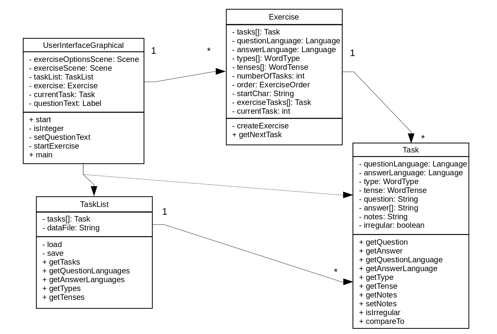
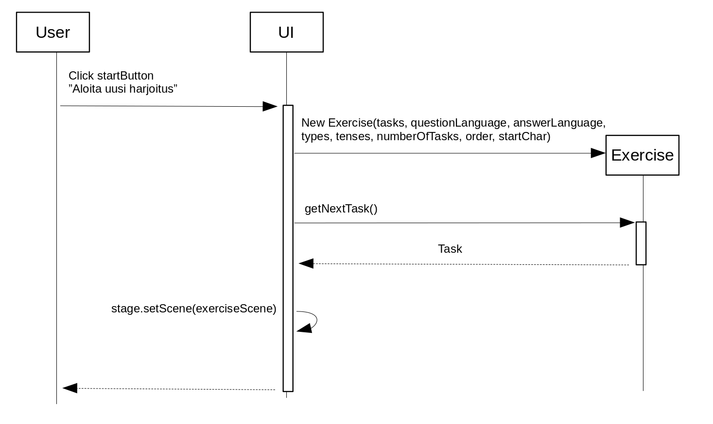

# Arkkitehtuurikuvaus

## Rakenne

Sovelluksen rakenteessa käyttöliittymät ja sovelluslogiikka on erotettu toisistaan. Pakkausrakenne on seuraava:
* languagetrainer.main
* languagetrainer.ui
* languagetrainer.domain

Pakkaus *languagetrainer.ui* sisältää JavaFX:llä toteutetun käyttöliittymän ja *languagetrainer.domain* sovelluslogiikan. Pakkaus *languagetrainer.main* sisältää pelkästään sovelluksen käynnistämisessä käytettävän main-luokan.

## Käyttöliittymä

Käyttöliittymä on toteutettu graafisesti JavaFX:llä. Käyttöliittymässä on kaksi näkymää:
* Päänäkymä
* Harjoitusnäkymä

Päänäkymässä valitaan sopivat asetukset uudelle harjoitukselle. Harjoitusnäkymässä vastataan harjoituksen kysymyksiin yksi kerrallaan ja tiettyyn sanaan liittyviä muistiinpanoja voidaan luoda ja muokata. Käyttöliittymä on pyritty eriyttämään sovelluslogiikasta. Käyttöliittymän komponentit kutsuvat sovelluslogiikan toimintoja.

Käyttöliittymän kieli on suomi. Valintalistojen käännökset haetaan tiedostosta *Translations.properties*.

## Sovelluslogiikka

Sovelluksen loogisen datamallin muodostavat luokat *Task*, *TaskList* ja *Exercise*. Luokka *Task* kuvaa yksittäistä tehtävää. Luokka *TaskList* sisältää listan kaikista sovelluksessa olevista yksittäisistä tehtävistä. Luokka *Exercise* kuvaa yksittäistä harjoitusta, joka koostuu tehtävistä. Luokkien välisiä suhteita kuvaa alla oleva luokkakaavio.

## Päätoiminnallisuudet

### Uuden harjoituksen aloittaminen

Sovellus avautuu graafisen käyttöliittymän näkymään, jossa käyttäjä voi määrittää haluamansa harjoituksen vaihtoehdot. Painamalla nappia "Aloita uusi harjoitus" (startButton), sovellus luo uuden harjoituksen ja vaihtaa käyttöliittymän näkymän harjoitusnäkymään, jossa harjoituksen kysymyksiin vastataan yksi kerrallaan. Alla oleva sekvenssikaavio kuvaa uuden harjoituksen aloitusta.

## Tietojen pysyväistallennus

Luokassa *TaskList* on toiminnot tehtävien lataamiseksi pysyväistallennuksessa käytettävästä tiedostosta ja tehtävien tallennus tiedostoon silloin, kun muistiinpanoja lisätään tai päivitetään.

Tiedostossa *config.properties* määritetään pysyväistallennuksessa käytettävän tiedoston nimi.

Tallennuksessa käytettävän tiedoston formaatissa yhden tehtävän tiedot ovat yhdellä rivillä tietyssä järjestyksessä ja erotettuna puolipisteellä.

## Ohjelman rakenteeseen jääneet heikkoudet

DAO-rajapintojen toteutusta harkittiin, mutta koska tiedostoja käsitellään vain kahden metodin kautta, tuntui siltä, että DAO-rakenne ei olisi tässä vaiheessa tuonut juurikaan höytyä.

Käyttöliittymä on toteutettu lähes kokonaan yhteen metodiin. Vaikka metodissa on melko paljon selventäviä kommentteja, olisi ehkä parempi jakaa käyttöliittymän toteutus jollain tavalla pienempiin osiin.
