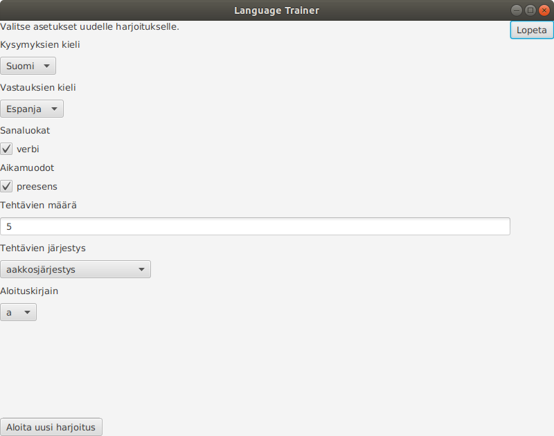
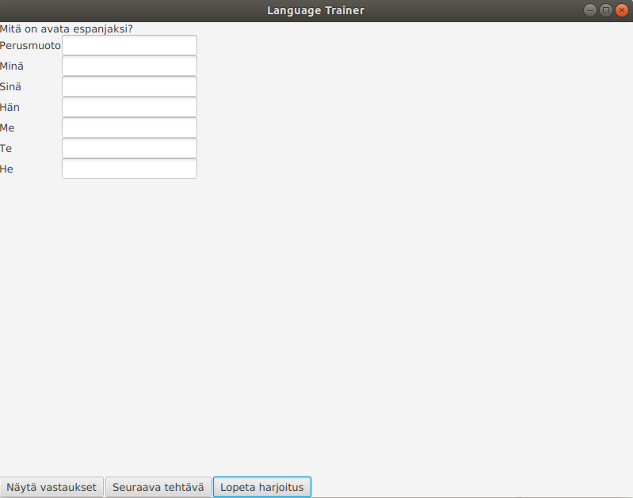

# Käyttöohje

Lataa tiedostot *languagetrainer.jar*, *vocabulary.csv* ja *config.properties*.

## Konfigurointi

Ohjelma olettaa, että sen käynnistyshakemistossa on tiedosto *config.properties* ja tehtävien pysyväistallennukseen käytettävä tiedosto. Tallennukseen käytettävän tiedoston nimi määritetään tiedostossa *config.properties* ja sen nimi on oletuksena *vocabulary.csv*. Ohjelman käyttäminen oletusasetuksilla siis onnistuu lataamalla yllä mainitut kolme tiedostoa samaan hakemistoon.

## Ohjelman käynnistäminen

Ohjelma käynnistetään komennolla

```
java -jar languagetrainer.jar
```

## Ohjelman käyttäminen

Ohjelma käynnistyy näkymään, jossa voi valita sopivat vaihtoehdot uudelle harjoitukselle. Aloituskirjaimen valinta tarkoittaa sitä, että tehtäviin valitaan espanjankieliset sanat, joiden alkukirjain on valittu kirjain tai aakkosjärjestyksessä sen jälkeen. Jos harjoitukseen valitaan kaikki sanaston sanat riippumatta alkukirjaimesta, valitaan aloituskirjaimeksi oletus eli *a*.



Tämän jälkeen painetaan nappia "Aloita uusi harjoitus", jonka jälkeen näkymä vaihtuu harjoitusnäkymään.



Harjoitusnäkymässä vastataan tehtävän kysymykseen. Vastaukset saa näkyville painamalla nappia "Näytä vastaukset". Seuraavan tehtävän saa näkyviin painamalla nappia "Seuraava tehtävä". Jokaisen tehtävään voi tallentaa muistiinpanoja eli esimerkiksi lauseen, jossa tehtävän sanaa käytetään tai sanan synonyymeja. Muistiinpanot tallennetaan painamalla napppia "Tallenna muistiinpano". Harjoituksen tekeminen lopetetaan painamalla nappia "Lopeta harjoitus" ja sovellus palaa takaisin aloitusnäkymään. Aloitusnäkymässä sovelluksen käytön voi lopettaa painamalla nappia "Lopeta".
