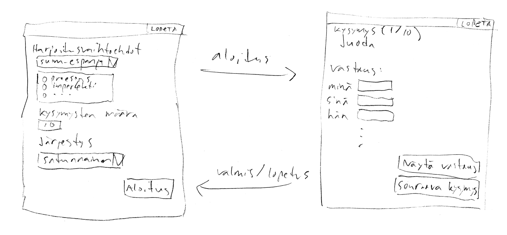

# Vaatimusmäärittely

## Sovelluksen tarkoitus

Sovelluksen avulla suomenkielentaitoinen henkilö voi opetella espanjan sanastoa.

## Käyttäjät

Sovelluksella on vain yksi käyttäjäryhmä eli kaikki käyttäjät voivat käyttää kaikkia sovelluksen sisältämiä ominaisuuksia.

## Käyttöliittymäluonnos

Sovellus aukeaa päävalikkoon. Päävalikosta siirrytään harjoitusnäkymään painamalla Aloitus-nappia. Harjoitus tehdään harjoitusnäkymässä ja siitä voi poistua painamalla Lopetus-nappia. Päävalikkoon siirrytään myös, kun kaikkiin kysymyksiin on vastattu.

## Perusversion tarjoama toiminnallisuus

* Perusversiossa on mahdollista opetella ainoastaan verbejä eri aikamuodoissa.
* Päävalikossa käyttäjä voi valita sopivan harjoituksen. Vaihtoehtoja ovat:
	* Harjoittelun suunta (suomi - espanja tai espanja - suomi)
	* Harjoituksen sisältämät aikamuodot (preesens, imperfekti, ...)
	* Kysymysten määrä
	* Kysymysten järjestys (satunnainen tai aakkosjärjestys)
* Valintojen jälkeen on mahdollista aloittaa harjoituksen tekeminen.
* Harjoitusnäytössä käyttäjä näkee kysymyksen ja voi vastata siihen.
* Tietystä verbistä kysytään kaikki persoonamuodot (esim. istun, istut, istuu, ...).
* Vastauksen jälkeen käyttäjä näkee oikean vastauksen.
* Kysymyksiin vastataan yksi kerrallaan.
* Harjoitus loppuu, kun kaikkiin kysymyksiin on vastattu.
* Käyttäjän on mahdollista lopettaa harjoitus kesken.
* Käyttöliittymän kautta ei voi lisätä uusia verbejä vaan sanaston ylläpito tehdään muokkaamalla tiedostoja.

# Jatkokehitysideoita

Perusversion jälkeen sovellusta mahdollisesti laajennetaan seuraavilla toiminnallisuuksilla:
* Harjoitukseen voi valita myös muita sanaluokkia kuin verbit.
* Harjoituksen vastaus tarkistetaan, eli käyttäjälle kerrotaan oliko vastaus oikein vai väärin.
* Tarkastus hyväksyy tavalliset merkit erikoismerkkien tilalle mutta huomauttaa niistä keltaisella värillä (esim. vastauksessa n hyväksytään vaikka pitäisi olla ñ).
* Sovelluksessa on pistelaskujärjestelmä eli oikeista vastauksista saa pisteitä ja kokonaispisteistä pidetään kirjaa.
* Harjoituksen voi tallentaa. Toisin sanoen täsmälleen saman harjoituksen voi tehdä uudestaan, vaikka kysymykset olisi valittu satunnaisessa järjestyksessä.

