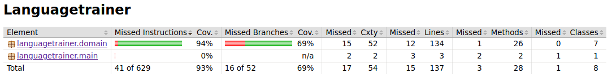

# Testausdokumentti

Ohjelman sovelluslogiikkaa on testattu jatkuvasti kehitystyön aikana automatisoidusti JUnitilla. Käyttöliittymää ja sovellusta kokonaisuutena on testattu melko paljon manuaalisesti.

Testauksessa on käytetty apuna tiedostoa *vocabularyForTesting.csv*, sillä sovelluksen tällä hetkellä käyttämä sanasto koostuu pelkästään preesensin verbeistä ja näin ollen monissa valinnoissa on vain yksi vaihtoehto. Tiedoston *vocabularyForTesting.csv* avulla valintoihin on saatu enemmän kuin yksi vaihtoehto. Tiedostoa tarvitaan osaan automaattisista testeistä ja lisäksi sitä on hyödynnetty manuaalisessa käyttöliittymän kautta tapahtuneessa testaamisessa.

## Yksikkö- ja integraatiotestaus

Sovelluslogiikka on pakkauksessa languagetrainer.domain. Tälle luokalle on tehty melko kattavat automaattiset testit, jotka testaavat yksittäisiä luokkia ja jonkin verran myös luokkien välisiä riippuvaisuuksia.

## Testauskattavuus

Sovelluksen automaattisen testauksen rivikattavuus on 93% ja haaraumakattavuus 69%. Luvuissa ei ole mukana käyttöliittymäkerrosta.

## Järjestelmätestaus

Sovelluksen järjestelmätestaus on tehty manuaalisesti kokeilemalla sovelluksen toimintoja käyttöliittymän kautta sekä muokkaamalla tiedostoa vocabulary.csv.

## Asennus ja konfigurointi

Sovellus on haettu ja konfiguroitu käyttöohjeen mukaisesti Ubuntu 18.04.4 LTS -ympäristöön sekä yliopiston Linux-ympäristöön. Sovellus tarvitsee toimiakseen käyttöohjeen mukaiset tiedostot. Jos niitä ei ole, tulostetaan käyttäjälle selkeä ilmoitus tiedostojen puuttumisesta eikä graafinen käyttöliittymä käynnisty. Myös tätä on testattu.

## Toiminnallisuudet

Kaikki toteutetut perustoiminnallisuudet on käyty läpi ja syöttökenttiä on kokeiltu myös virheellisillä syötteillä käyttöliittymässä.

## Sovellukseen jääneet laatuongelmat

Käyttöliittymä on toteutettu perusasetuksilla ja siksi sen visuaalinen ulkoasu ei ole erityisen hyvä. Harjoitustyön aikana on keskitytty lähes täysin toiminnallisuuden toteuttamiseen.

Sovelluksen toiminnallisuus on melko yksinkertainen. Kuitenkin alussa tavoitteena ollut perustoiminnallisuus on toteutettu ja lisäksi on toteutettu muutama lisätoiminnallisuus, kuten muistiinpanojen tallennus. Koska sovellus jää todelliseen käyttöön myös harjoitustyön toteutuksen jälkeen, sovelluksen toiminnallisuutta on tarkoitus laajentaa myös kurssin päättymisen jälkeen.
